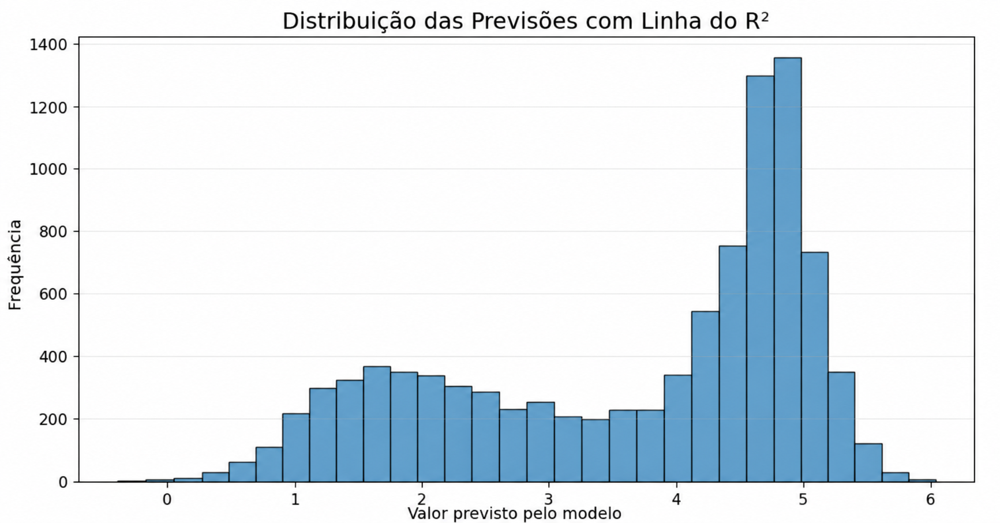

# modelo_score_aws
## Comparação dos modelos para melhor decisão

  
  

  

----------------------------------------------------------------------
## Colunas Utilizadas como X

  

----------------------------------------------------------------------
## R2 do Modelo

  

----------------------------------------------------------------------
## Histograma de Comportamento

  

----------------------------------------------------------------------
## Conclusão

<table align="center">
  <tr>
    <th>Métrica</th>
    <th>Valor</th>
  </tr>
  <tr>
    <td><b>R² (Treinamento)</b></td>
    <td>0.7710</td>
  </tr>
  <tr>
    <td><b>R² (Teste)</b></td>
    <td>0.7408</td>
  </tr>
  <tr>
    <td><b>MAE</b></td>
    <td>0.6075</td>
  </tr>
  <tr>
    <td><b>RMSE</b></td>
    <td>0.8223</td>
  </tr>
</table>

 

O modelo de regressão linear apresentou desempenho satisfatório na previsão das avaliações dos usuários.
O <b>R² de teste = 0.7408</b> indica que aproximadamente <b>74%</b> da variação das notas pode ser explicada pelas variáveis utilizadas no modelo.
A proximidade entre o <b>R² de treinamento = 0.7710</b> e o <b>R² de teste = 0.7408</b> sugere boa capacidade de generalização, sem indícios significativos de sobreajuste.

Em relação aos erros, o modelo apresentou <b>MAE = 0.6075</b> e <b>RMSE = 0.8223</b>, indicando que as previsões diferem das avaliações reais em menos de uma estrela, em média. Considerando uma escala de <b>1 a 5 estrelas</b>, os resultados demonstram previsões relativamente próximas dos valores observados.

